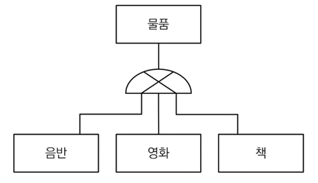
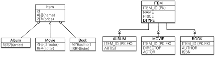
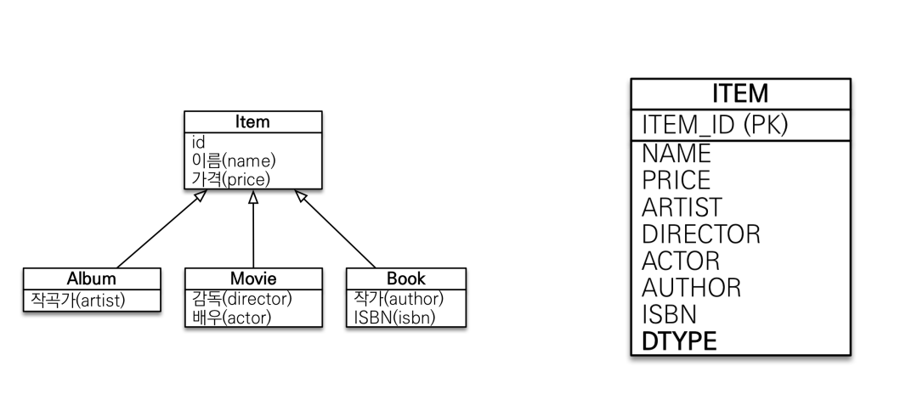
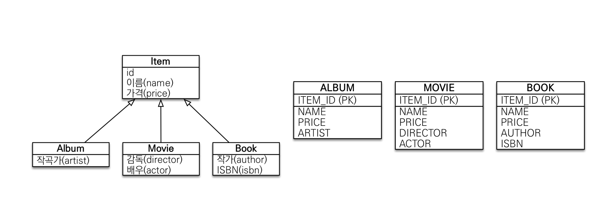
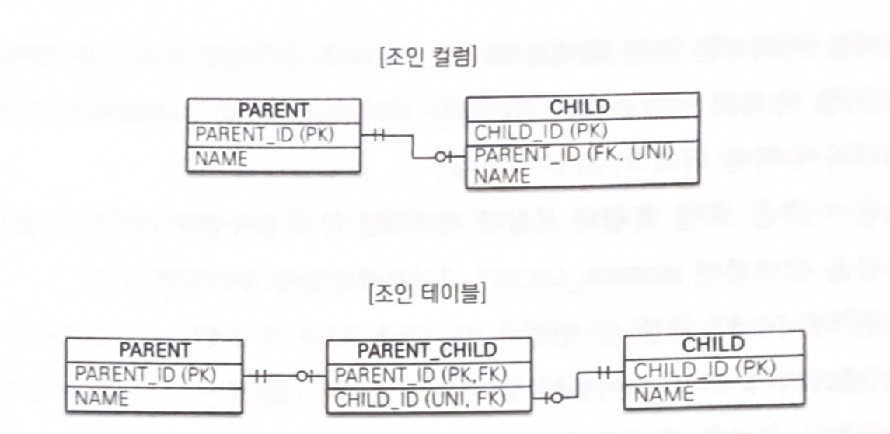
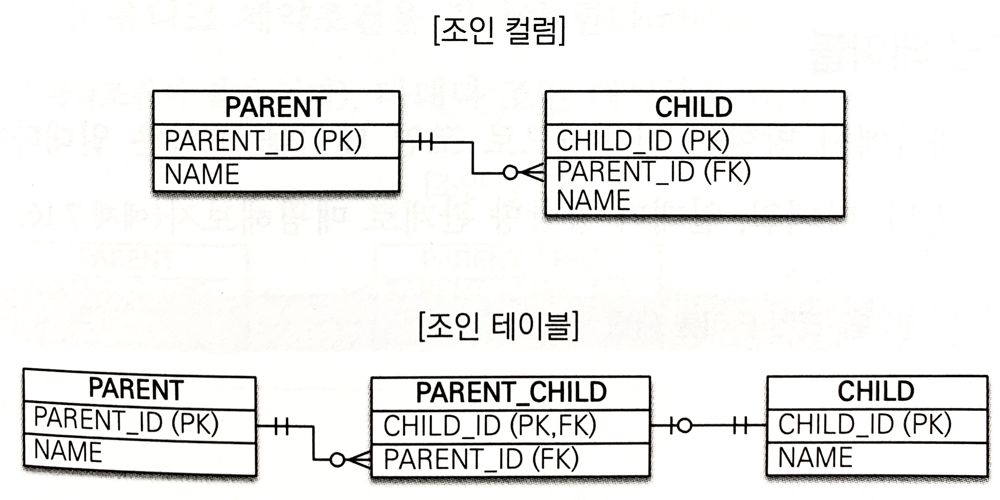
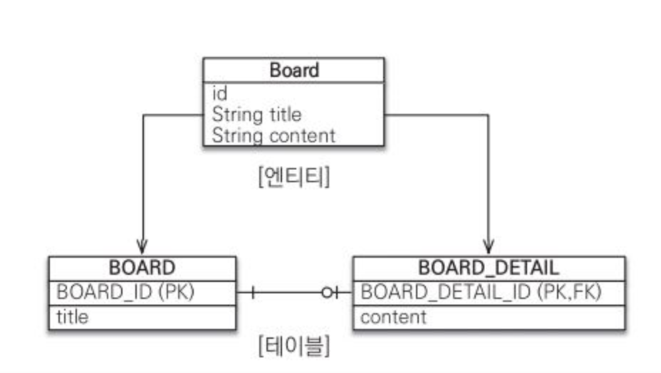

# 상속관계 매핑

- db에 상속 개념과 그나마 비슷한 것 : super-type sub-type relationship
    
    
    

실제 물리모델로 구현하는 방법

- 각각의 테이블로 변환 : 각각을 테이블로 만들고 조회할 때 조인을 사용.(조인전략)
- 통합 테이블로 변환 : 테이블을 하나만 사용해서 통합(단일 테이블 전략)
- 서브타입 테이블로 변환 : 서브 타입마다 하나의 테이블을 만듦(구현 클래스마다 테이블 전략)

## 조인 전략

- 부모 테이블의 기본 키를 자식 테이블의 기본키+외래키로 사용. (조회 시  조인을 사용)

 

<aside>
💡

@Inheritance(strategy = InheritanceType.JOINED)

</aside>

```java
@Entity
@Inheritance(strategy = InheritanceType.JOINED) // 부모 클래스에 상속 매핑. (매핑전략)
@DiscriminatorColumn(name="DTYPE") //부모 클래스에 구분 칼럼 지정
public abstract class Item {
	@Id
	@GeneratedValue
	@Column(name="ITEM_ID")
	private Long id;
	
	private String name;
	private int price;
}

@Entity
@DiscriminatorValue("A") // 엔티티 저장 시 괄호 값이 구분 칼럼에 저장.
public class Albuum extends Item{
	private String artist;
}

@Entity
@DiscriminatorValue("M")
public class Movie extends Item{
	private String director;
	private String actor;
}

//디폴트 : 자식테이블의 id컬럼은 부모 테이블의 id컬럼명을 그대로 사용
@Entity
@DiscriminatorValue("B")
@PrimaryKeyJoinColumn(name="BOOK_ID") // id명 재정의
public class Book extends Item {...}
```

**장점**
- 테이블 정규화
- 외래키 참조 무결성 제약조건 활용 가능
- 효율적인 저장공간 사용

**단점**

- 조회 시 많은 조인 사용으로 인한 성능 저하.
- 조회 쿼리가 복잡함
- 데이터 등록할 INSERT문이 2번 실행됨

## 단일 테이블 전략

- 모든 필드를 한 테이블에 때려넣고 DTYPE으로 구분해서 사용하는 전략

** 주의점 : 자식 엔티티가 매핑한 칼럼은 null을 허용해야함!!

<aside>
💡

@Inheritance(strategy = InheritanceType.SINGLE_TABLE)

</aside>


 

```java
@Entity
@Inheritance(strategy = InheritanceType.SINGLE_TABLE) // 부모 클래스에 상속 매핑. (매핑전략)
@DiscriminatorColumn(name="DTYPE") //부모 클래스에 구분 칼럼 지정
public abstract class Item {
	@Id
	@GeneratedValue
	@Column(name="ITEM_ID")
	private Long id;
	
	private String name;
	private int price;
}

@Entity
@DiscriminatorValue("A") // 엔티티 저장 시 괄호 값이 구분 칼럼에 저장.
public class Albuum extends Item{...}

@Entity
@DiscriminatorValue("M")
public class Movie extends Item{...}

@Entity
@DiscriminatorValue("B")
public class Book extends Item {...}
```

**장점**

- 조인이 필요 없어 조회 성능이 빠름
- 단순한 조회쿼리

**단점**

- 자식 엔티티가 매핑한 컬럼은 모두 nullable=true
- 단일 테이블에 모든 것을 저장 ⇒ 테이블이 커짐 ⇒ 경우에 따라 오히려 조회 성능 악화 가능

**특징**

- 구분 컬럼을 꼭 사용해야함(@DiscriminatorColumn)
- @DiscriminatorValue 기본 설정은 엔티티 이름

## 구현 클래스마다 테이블 전략(비추천)

<aside>
💡

@Inheritance(strategy = InheritanceType.TABLE_PER_CLASS)

</aside>



```java
@Entity
@Inheritance(strategy = InheritanceType.TABLE_PER_CLASS) // 부모 클래스에 상속 매핑. (매핑전략)
public abstract class Item {
	@Id
	@GeneratedValue
	@Column(name="ITEM_ID")
	private Long id;
	
	private String name;
	private int price;
}

@Entity
public class Albuum extends Item{...}

@Entity
public class Movie extends Item{...}

@Entity
public class Book extends Item {...}
```

**장점**

- 서브 타입을 구분해 처리할 때 효과적
- not null 제약조건 사용 가능

**단점**

- 여러 자식 테이블을 함께 조회할 때 성능 구림(UNION 사용)
- 자식 테이블 통합 쿼리하기 어려움

**특징**

- 구분 컬럼 사용하지 않음

# @MappedSuperclass

- 상속 관계 매핑 : 부모 클래스와 자식 클래스 모두 db에 매핑
- @MappedSuperclass : 부모 클래스는 매핑하지 않고, 자식에게 매핑 정보만 제공.

```java
@MappedSuperclass
public abstract class BaseEntity {
	@Id @GeneratedValue
	private Long id;
	private String name;
}

@Entity
public class Member extends BaseEntity {
	//BaseEntity의 필드 상속
	private String email;
}
```

- 매핑 정보를 재정의

```java
@Entity
@AttributeOverrides({
@AttributeOverride(name="id", column = @Column(name="member_id")),
@AttributeOverride(name="name", column = @Column(name="member_name"))
})
public class Member extends BaseEntity{...}
//id의 컬럼명을 member_id로 재정의
//name을 member_name으로
```

특징

- 직접 생성할 일이 없으므로 추상 클래스로 만드는 것을 권장
- 엔티티가 아니므로 em.find()나 JPQL로 사용 불가능


# 복합키와 식별관계 매핑

- 식별관계 : 부모 테이블의 기본키 = 자식 테이블의 기본키 + 외래키
- 비식별관계 : 부모 테이블의 기본키 = 자식 테이블의 외래키 / 자식테이블의 기본키는 따로 존재
    - 필수적 : nullable = false인 외래키. 연관관계 필수.
    - 선택적 : nullable= true인 외래키. 연관관계 선택 가능.
- 주로 비식별관계를 사용하고, 꼭 필요한 곳에만 식별 관계를 사용.
- @GeneratedValue 사용 불가능. 구성 컬럼에도 사용 불가능.

복합키 설정

1. @IdClass : 관계형 db 관점
2. @EmbeddedId : 객체지향 관점

<aside>
💡

기본키로서의 복합키, 외래키로서의 복합키, 기본키+외래키로서의 복합키를 어떻게 표현하는가를 중심으로 보면 이해가 빠르다

</aside>

## @IdClass

***기본키로서의 복합키***

```java
@Entity
@IdClass(ParentId.class) //@IdClass로 식별자 클래스가 뭔지 알려줌
public class Parent{
	@Id
	@Column(name="PARENT_ID1")
	private String id1;
	
	@Id
	@Column(name="PARENT_ID2")
	private String id2;
	
	priavte String name;
	...
}

//식별자클래스
public class ParentId implements Serializable{
	private String id1;
	private String id2;
	
	public ParentId(){}
	
	public ParentId(String id1, String id2){
		this.id1 = id1;
		this.id2 = id2;
	}
	
	@Override
	public boolean equals(Object o){...}
	
	@Override
	public int hashCode(){...}
}
```

**조건**

- 식별자 클래스 속성명 = 엔티티 내 식별자속성명
- Serializable 인터페이스 구현
- 기본 생성자
- 식별자 클래스 범위는 public

저장, 조회

```java
//저장
Parent parent = new Parent();
parent.setId1("myId1");
parent.setId2("myId2");
parent.setName("parentName");
em.persist(parent);

//조회
ParentId parentId = new ParentId("myId1", "myId2");
Parent parent = em.find(Parent.class, parentId);
```

자식 클래스 : ***외래키로서의 복합키***

```java
@Entity
public class Child{
	@Id
	private String id;
	
	@ManyToOne
	@JoinColumns({ // JoinColumns로 여러 컬럼을 묶어주고 있다
		@JoinColumn(name="PARENT_ID1",
			referencedColumnName = "PARENT_ID1"),
			@JoinColumn(name="PARENT_ID2",
			referencedColumnName = "PARENT_ID2")
	})
	private Parent parent;
}
```

## @EmbeddedId

```java
@Entity
public class Parent{
	@EmbeddedId
	private ParentId id; //식별자 클래스를 직접 사용
	
	private String name;...
}

//식별자 클래스
@Embeddable
public class ParentId implements Serializable{
	@Column(name="PARENT_ID1")
	private String id1;
	
	@Column(name="PARENT_ID2")
	private String id2;
	...
}
```

조건

- @Embeddable 어노테이션
- Serializable 인터페이스 구현
- equals, hashCode 구현
- 기본 생성자 필수
- 식별자 클래스 범위 public

저장, 조회

```java
Parent parent = new Parent();
ParentId parentId = new ParentId("myId1", "myId2");
parent.setId(parentId); // 복합키 객체를 키로 설정
parent.setName("parentName");
em.persist(parent);

ParentId parentId = new ParentId("myId1", "myId2");
Parent parent = em.find(Parent.class, parentId);
```

---

***기본키+외래키로서의 복합키***

위의 부모, 자식 엔티티에서 자식 엔티티의 기본키를 {부모의 기본키 + 자식의 기본키}로 바꿔보겠다

@IdClass 버전

```java
@Entity
@IdClass(ChildId.class)
public class Child{
	@Id
	private String id;
	
	@Id
	@ManyToOne
	@JoinColumns({ // JoinColumns로 여러 컬럼을 묶어주고 있다
		@JoinColumn(name="PARENT_ID1",
			referencedColumnName = "PARENT_ID1"),
			@JoinColumn(name="PARENT_ID2",
			referencedColumnName = "PARENT_ID2")
	})
	private Parent parent; // Parent entity를 참조
	...
}

//식별자 클래스
public class ChildId implements Serializable {
	private ParentId parent; // **parent의 식별자 클래스**를 선언하고 있다.
	private String id;
}
```

@EmbeddedId 버전 (@MapsId)

```java
@Entity
public class Child{
	@EmbeddedId // 어노테이션
	private String id;
	
	@MapsId("parentId") // ChildId.parentId로 매핑
	@ManyToOne
	@JoinColumns({ // JoinColumns로 여러 컬럼을 묶어주고 있다
		@JoinColumn(name="PARENT_ID1",
			referencedColumnName = "PARENT_ID1"),
			@JoinColumn(name="PARENT_ID2",
			referencedColumnName = "PARENT_ID2")
	})
}

@Embeddable
public class ChildId implements Serializable {
	private ParentId parentId; // @MapsId("parentId")로 매핑
	
	@Column (name = "Child_id")
	private String id;
}
```

@MapsId : 외래키와 매핑한 연관관계를 기본키에도 매핑하겠다.

## @MapsId의 또다른 사용 : 일대일 식별 관계

- 자식 테이블의 기본 키 값 = 부모 테이블의 기본키 값
- 자식의 @MapsId 속성값을 비워두어 외래키가 자식의 기본키에 매핑되도록 한다
    
    
    

```java
@Entity
public class Board {
	@Id @GeneratedValue
	@Column(name="BOARD_ID")
	private Long id;
	
	@OneToOne(mappedBy = "board")
	private BoardDetail boardDetail;
}

@Entity
public class BoardDetail{
	@Id
	private Long boardId;
	
	@MapsId // boardId에 매핑
	@OneToOne
	@JoinColumn(name="BOARD_ID")
	private Board board;
	...
}
```

<aside>
💡

추천 : 되도록 비식별 관계를 사용, 기본키는 Long 타입의 대리키.

선택적 비식별보다는 필수적 비식별(Outer join이 아닌 inner join으로 해결 가능)

</aside>

# 조인 테이블

테이블의 연관관계를 설계하는 방법

1. 조인 컬럼 (외래 키) : @JoinColumn
2. 조인 테이블 : @JoinTable
    - 테이블을 하나 더 추가해야하는 부담이 있음
    - 주로 다대다 관계에서 사용되나, 일대일, 일대다, 다대일에서도 사용될 수 있다.
    

## 일대일 조인 테이블



```java
@Entity
public class Parent{
	@Id @GeneratedValue
	@Column(name="parent_id")
	private Long id;
	
	private String name;
	
	@OneToOne
	@JoinTable(name = "parent_child",
		joinColumns = @JoinColumn(name="parent_id"),
		inverseJoinColumns = @JoinColumn(name="child_id))
	private Child child;
}

@Entity
public class Child{
	@Id @GeneratedValue
	@Column(name="child_id")
	private Long id;
	
	private String name;
}
```

## 일대다, 다대일 조인 테이블



일대다 단방향

```java
@Entity
public class Parent {
	@Id @GeneratedValue
	@Column(name="parent_id")
	private Long id;
	
	private String name;
	
	@OneToMany
	@JoinTable(name="parent_child",
		joinColumns = @JoinColumn(name="parent_id"),
		inverseJoinColumns = @JoinColumn(name="child_id"))
	private Child child;
}

@Entity
public class Child{
	@Id @GeneratedValue
	@Column(name="child_id")
	private Long id;
	
	prviate String name;
}
```

다대일

```java
@Entity
public class Parent {
	@Id @GeneratedValue
	@Column(name="parent_id")
	private Long id;
	
	private String name;
}

@Entity
public class Child{
	@Id @GeneratedValue
	@Column(name="child_id")
	private Long id;
	
	prviate String name;
	
	@ManyToOne(optional = false)
	@JoinTable(name="parent_child",
		joinColumns = @JoinColumn(name="child_id"),
		inverseJoinColumns = @JoinColumn(name="parent_id"))
	private Parent parent;
}
```

# 엔티티 하나에 여러 테이블 매핑 : @SecondaryTable

<aside>
💡

두 테이블을 하나에 매핑하는 @SecondaryTable 보다는,

테이블 당 엔티티를 각각 만들어 일대일 매핑하는 것을 권장.

</aside>



```java
@Entity
@Table(name="BOARD")
@SecondaryTable(name = "Board_Detail",
	pkJoinColumns = @PrimaryKeyJoinColumn(name="Board_Detail_Id"))
public class Board{
	@Id @GeneratedValue
	@Column(name="Board_Id")
	private Long id;
	
	private String title;
	
	@Column(table = "Board_Detail") //기본테이블인 board가 아닌 secondary인 board_detail에 매핑
	private String content;
}
```

더 많이 매핑하고 싶으면
```java
@SecondaryTables(
	@SecondaryTable(),
	@SecondaryTable()
)
```