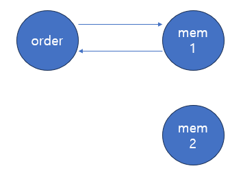
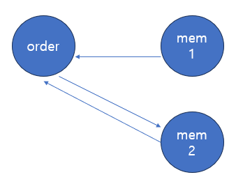
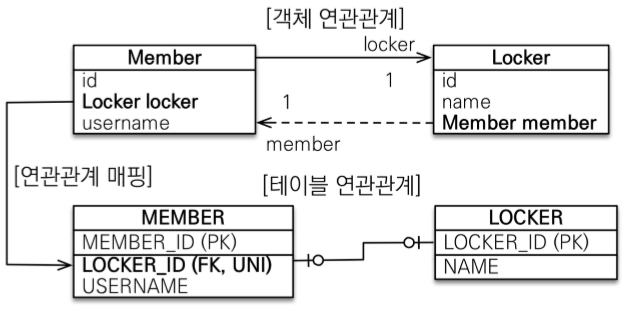
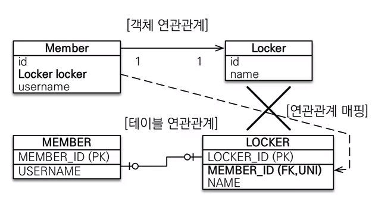
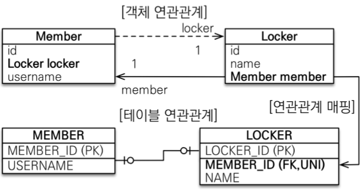

# 양방향 매핑

두 연관관계 중 하나를 연관관계의 주인으로 정해야한다. (mappedBy로 표시 ⇒ 안 쓰는 쪽이 주인)

- 주인
    - db 연관관계와 매핑
    - 외래키를 db에 등록, 수정, 삭제할 수 있음.
    - 매핑된 테이블에 외래키가 있는 쪽.
- 주인 아닌 쪽
    - 읽기만 가능.

- 단방향과의 차이(=장점) : 반대방향으로 객체 그래프 탐색 기능이 추가됨

# 양방향 연관관계의 주의점

```java
 // Member 객체 생성
        Member member = new Member("John Doe");

        // Order 객체 생성
        Order order1 = new Order("Product 1");
        Order order2 = new Order("Product 2");

        // persist: DB에 저장
        em.persist(member);

        //연관관계 설정 : Order -> Member
        order1.setMember(member);
        order2.setMember(member);
        em.persist(order1);
        em.persist(order2);
        
        Member findMember = em.find(Member.class, member.getId());
        System.out.println("Member: " + findMember.getName());
        System.out.println("Orders:");
        for (Order o : findMember.getOrders()) {
            System.out.println(" - " + o.getProductName());
        }
 
 Hibernate: 
    /* insert for
        sjw.reebservice.domain.Member */insert 
    into
        member (name) 
    values
        (?)
Hibernate: 
    /* insert for
        sjw.reebservice.domain.Order */insert 
    into
        `order` (
            member_id, product_name
        ) 
    values
        (?, ?)
Hibernate: 
    /* insert for
        sjw.reebservice.domain.Order */insert 
    into
        `order` (
            member_id, product_name
        ) 
    values
        (?, ?)
Member: John Doe
Orders://order1, order2가 출력되지 않는다.
```

‘외래키를 등록, 수정,삭제 가능한 쪽은 연관관계 주인을 가진 테이블이니, 다른 쪽은 굳이 set해줄 필요가 없다.’고 생각할 수 있는데, 이처럼 객체에는 반영이 되지 않는다. (em.flush() 후 em.find(member.class)하면 db에서 가져오므로 반영이 된다.)

- 따라서 객체의 양방향 연관관계는 양쪽 모두 관계를 맺어줘야한다.

아니 그럼 매번 일일이 신경 써야하는가?

# 연관관계 편의 메소드

연관관계 주인의 setter에서 연관관계 주인이 아닌 쪽의 set까지 하면 된다!

```java
//Order class
    @ManyToOne
    @JoinColumn(name = "member_id")
    private Member member;
    
    public void setMember(Member member){
	    this.member = member;
	    member.getOrders().add(this);
    }
```

짜잔! 끝!

이 아니다.

```java
order.setMember(mem1);
order.setMember(mem2);
Order findOrder = mem1.getMember();//여전히 order이 조회된다.
```



연관관계 주인이 아닌 쪽의 연관관계가 끊어지지 않았다.

- db 상에는 문제가 없다.(연관관계 주인의 설정만이 반영되므로)
- 객체 상에는 문제가 있다(연관관계 주인이 아닌 쪽에서는 계속 조회가 된다.)

```java
//Order class
    @ManyToOne
    @JoinColumn(name = "member_id")
    private Member member;
    
    public void setMember(Member member){
	    if(this.member != null)
		    this.member.getOrders().remove(this); // 연관관계 주인 아닌 쪽을 끊어내기//Order class    @ManyToOne    @JoinColumn(name = "member_id")    private Member member;        public void setMember(Member member){	    if(this.member != null)		    this.member.getOrders().remove(this); // 연관관계 주인 아닌 쪽을 끊어내기
	    this.member = member;
	    member.getOrders().add(this);
    }
```


# 일대다 단방향 매핑 (@OneToMany)

- 매핑한 객체가 관리하는 외래키가 다른 테이블에 있다
- 매핑 객체 == 외래키 가진 테이블 ⇒ INSERT 문으로 끝남
- 매핑 객체 ≠ 외래키 가진 테이블 ⇒ UPDATE문도 발생!!!

```java
@Entity
public class Team{
	@Id @GeneratedValue
	@Column(name="TEAM_ID")
	private Long id;
	
	private String name;
	
	@OneToMany
	@JoinColumn(name="TEAM_ID") // 반대편 테이블(member)의 외래키 team_id
	private List<Member> members = new ArrayList<Member>();
	//Getter, Setter
}

@Entity
public class Member{
	@Id @GeneratedValue
	@Column(name="member_id")
	private Long id;
	
	private String username;
	//Getter, Setter
}

//실행 시
Member mem1 = new Member("mem1");
Member mem2 = new Member("mem2");

Team team1 = new Team("team1");
team1.getMembers().add(mem1);
team1.getMembers().add(mem2);

em.persist(mem1); // insert mem1
em.persist(mem2); // insert mem2
em.persist(team1); // insert team1, update mem1.fk, update mem2.fk
```

- 엔티티를 매핑한 테이블이 아닌 다른 테이블의 외래키를 관리
- 성능문제와 관리 문제 초래
- 따라서 일대다 단방향 대신 다대일 양방향 매핑을 사용.


# 일대일 @OneToOne

- 주 테이블에 외래키
    - 객체 지향적 관점
    - 외래키를 객체 참조와 비슷하게 사용 가능.
- 대상 테이블에 외래키
    - 전통적인 db 방식에서 선호됨
    - 테이블 관계를 일대일에서 일대다로 변경할 때 테이블 구조가 유지될 수 있음

주 / 대상 테이블 구분은 현실에서 볼 때 소유관계로 지정할 수 있는듯.

ex) 주 : member / 대상 : locker

@OneToOne을 member에는 무조건 건다고 생각했을 때, 어떤 경우를 구현할 수 있을까?

- 주테이블에 외래키가 있는 경우 : 단방향, 양방향
    

- 대상테이블에 외래키 있는 경우 : 양방향 가능
    - 단방향 불가능
        - @OneToOne을 member에 걸어놓고, 실제 외래키는 locker 테이블에 있는다? ⇒ 불가능
        - 단방향 관계를 locker →member 방향으로 바꿔야함.


```java
@Entity
public class Member {
	@Id @GeneratedValue
	@Column(name="MEMBER_ID")
	private Long id;
	
	private String username;
	
	@OneToOne(mappedBy="member")
	private Locker locker;
}

@Entity
public class Locker{
	@Id @GeneratedValue	
	@Column(name="LOCKER_ID")
	private Long id;
	
	private String name;
	
	@OneToOne
	@JoinColumn(name="MEMBER_ID")
	private Member member;
}
```



<aside>
💡

프록시 사용 시 외래키를 직접 관리하지 않는 일대일 관계는 지연 로딩으로 설정해도 즉시 로딩된다.

Locker.member는 지연 로딩할 수 있지만, Member.locker는 지연 로딩으로 설정해도 즉시 로딩된다.

프록시의 한계 때문인데, 프록시 대신 bytecode instrumentation을 사용하면 해결 가능.

</aside>

# 다대다 @ManyToMany

- 테이블은 n:m인 경우 1:n, n:1 관계로 쪼개어 중간에 연결 테이블을 둔다.
- 객체는 다대다 관계를 만들 수 있다.

다대다 단방향

```java
@Entity
public class Member {
	@Id @Column(name="MEMBER_ID")
	private String id;
	
	private String username;
	
	@ManyToMany // 다대다 매핑
	@JoinTable(name="MEMBER_PRODUCT", // 연결 테이블 바로 매핑
		joinColumns = @JoinColumn(name="MEMBER_ID"),
		inverseJoinColumns = @JoinColumn(name = "PRODUCT_ID"))
	private List<Product> products = new ArrayList<Product>();
}

@Entity
public class Product {
	@Id @Column(name="PRODUCT_ID")
	private String id;
	private String name;
}
```

```java
다대다 관계 저장 예제
public void save(){
	Product poduct1 = new Product();
	product1.setId("product1");
	product1.setName("상품1");
	em.persist(product1);
	
	Member mem1 = new Member();
	mem1.setId("mem1");
	mem1.setUsername("kim");
	mem1.getProducts().add(product1);
	em.persist(mem1);
}

//실행되는 DDL
INSERT INTO PRODUCT
INSERT INTO MEMBER
INSERT INTO MEMBER_PRODUCT

탐색
public void find(){
	Member member = em.find(Member.class, "mem1");
	List<Product> products = member.getProducts();
	for(Product product : products){
		System.out.println("product.name = " + product.getName();
	}
}

SELECT * FROM MEMBER_PRODUCT MP
INNER JOIN PRODUCT P ON MP.PRODUCT_ID = P.PRODUCT_ID
WHERE MP.MEMBER_ID=?
```

다대다 양방향

```java
@Entity
public class Member {
	@Id @Column(name="MEMBER_ID")
	private String id;
	
	private String username;
	
	@ManyToMany // 다대다 매핑
	@JoinTable(name="MEMBER_PRODUCT", // 연결 테이블 바로 매핑
		joinColumns = @JoinColumn(name="MEMBER_ID"),
		inverseJoinColumns = @JoinColumn(name = "PRODUCT_ID"))
	private List<Product> products = new ArrayList<Product>();
	
	public void addProduct(Product product){ //연관관계 편의 메소드
		...
		products.add(product);
		product.getMembers().add(this);
	}
}

@Entity
public class Product {
	@Id @Column(name="PRODUCT_ID")
	private String id;
	private String name;
	
	@ManyToMany(mappedBy="products") //양방향 매핑
	private List<Member> members;
}
```

다대다 매핑의 한계

- 회원이 상품을 주문하면 연결테이블에 단순히 회원id와 상품id를 담고 끝나지 않는다.
- 주문 수량, 주문날짜 등의 칼럼이 더 필요하다

- 

```java
중간테이블
@Entity
@IdClass(MemberProductId.class) // 복합기본키 매핑
public class MemberProduct{
	@Id // 기본키 매핑
	@ManyToOne
	@JoinColumn(name="MEMBER_ID") // 외래키 매핑
	private Member member; //부모 테이블의 기본키를 자신의 기본키+외래키로 사용 = 식별관계
	
	@Id
	@ManyToOne
	@JoinColumn(name="PRODUCT_ID")
	private Product product;
	
	private int orderAmount;
}

//식별자 클래스
public class MemberProductId implements Serializable{
	private String member; // MemberProduct.member와 연결
	private String product; // MemberProduct.product와 연결
	
	@Override
	public boolean equals(Object o){...}
	
	@Override
	public int hashCode(){...}
}
```

## ** 복합 기본키

- 별도의 식별자 클래스로 만든 후, 엔티티에 @IdClass로 연결(혹은 @EmbeddedId)
- Serializable 구현
- equals(), hashCode() 구현
- public 클래스

**복합키 관리는 까다로우므로, 새로운 기본키를 지정하여 비식별관계로 구현하기도 한다.